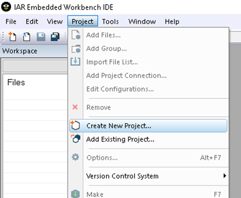
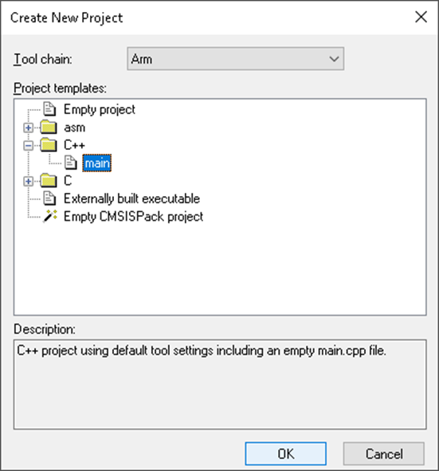
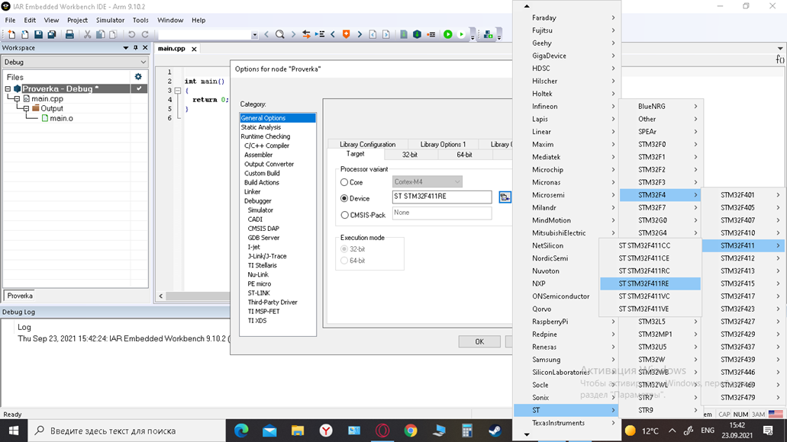
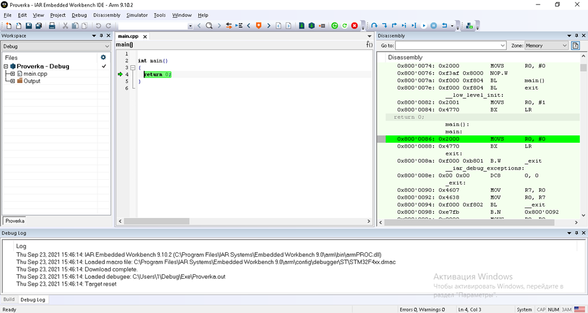
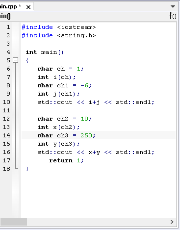
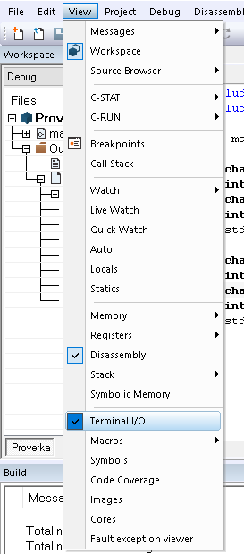
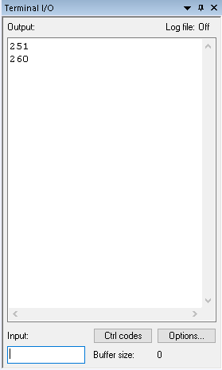
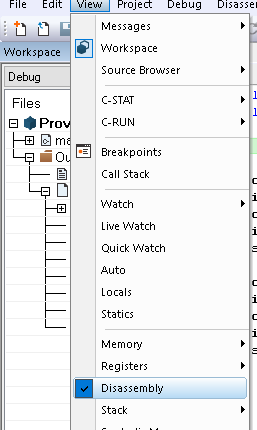
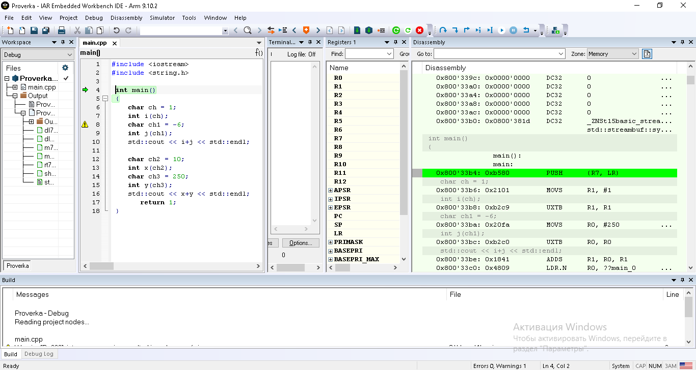
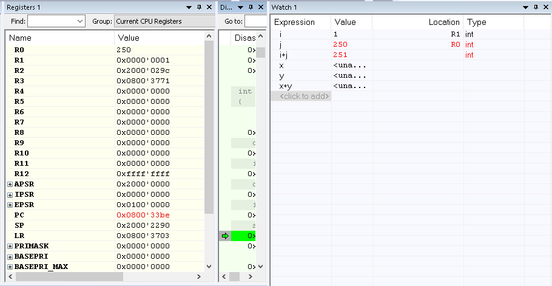

:figure-caption: Рисунок

= Отчет по лабораторной работе №0

== Задание

* Необходимо создать проект *Lab1* на микроконтроллере *STM32F411RE*. Для создания проекта мы используем интегрируемую среду разработки *IAR Embedded Workbench*, где нужно написать код программы, которая считает сумму двух *char* чисел в качестве примера взяты числа *1* и *-6*, *10* и *250*.

=== Создать проект C++ c main.cpp

Для создания проекта мы используем интегрируемую среду разработки IAR Embedded Workbench

Project>Create New Project... (рисунок 1)

.Создание нового проекта

Выбираем язык C++ и глобальную функцию main (рисунок 2)

.Настройки новго проекта

Сохраним проект под каким-либо именем
В свойствах проекта выбираем модель микроконтроллера ST => STM32F4=> STM32F411=> ST STM32F411RE. Для этого правой кнопкой мыши щелкнуть по проекту, выбирать Options
и далее в категории General Option выбрать закладку Target (рисунок 3).

.Выбор микроконтроллера

Наш проект выглядит так (рисунок 4):

.Стартовый вид проекта

==== Далее необходимо сделать программу которая будет считать сумму двух char чисел.
Код программы (рисунок 5)

.Вид созданного роекта

Результат был выведен в Terminal I/O
*Terminal I/O* - это вид консоли, которая позволяет наблюдать за результатом вывода программы.

Подключение выглядит следующим образом (рисунок 6):

.Подключение Terminal I/O

А результат показан на рисунке 7.

.Результат

Результаты объясняются тем, что переменная char - 8-битное число, то есть ее вместимость 256 символов от 0 до 255. При сложении 1 + (-6) получаем число равное -5, но в переменной *char* такого числа нет и она уменьшается с конца, то есть мы получаем число 251. При суммировании чисел 10 и 250 полученный результат не является удовлетворительным.

==== Также одним из необходимых шагов является запуск проекта в режиме симуляции.

Для этого необходимо подключить Disassembly, как показано на рисунке 8.

.Подключение Disassembly

На рисунке 9 показан режим отладки программы.

.Режим отладки программы

Чтобы запустить процесс отладки необходимо нажать комбинацию клавиш *Ctrl+D*

При нажатии на клавиши *F10* или *F11*, происходит так называемый процесс пошаговой отладки, благодаря которому мы можем определить где создались переменные.

Для того чтобы остановить отладку достаточно нажать комбинацию клавиш *Ctrl+Shift+D*.

==== Чтобы просмотреть как изменяются переменные нужно подключить окна *Watch* и *Registers*.
Окно *Registers* отвечает за значения созданных регистров.

В то время как окно *Watch* позволяет наблюдать изменения значений.

.Переменные в окнах Watch и Registers

Ответы на вопросы:
--—

*1)* Интегрированная среда разработки (IDE) - это программное приложение, предоставляющее комплексные возможности программистам для разработки программного обеспечения.

--—

*2)* Компилятор выполняет действия, записанные в программе, а транслятор лишь транслирует действия в машинный код без возможности выполнения.

--—

*3)* Компоновщик, от слова компоновать - собирать в одно целое, - средство, собирающее все строчки кода в одну работающую программу.

--—

*4)* Процесс проектирования важен, потому что именно во время проектирования решаются все важные задачи: какой будет программа, вопросы ее реализации и т. д.

--—

*6)* Процесс отладки нужен для того, чтобы пошагово проверить каждую строчку кода и выявить возможные ошибки в действии компилятора или в написании кода.

--—